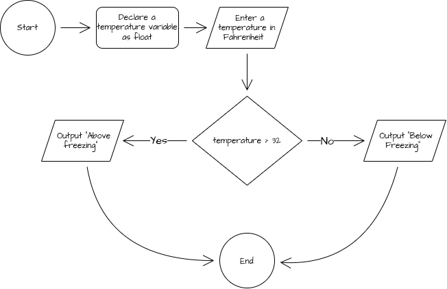

# Debugging Warm-Up 03

Prompts the user to enter a temperature and outputs if it is above or below freezing.

## Flow Chart



## Pseudocode

```
FUNCTION main()
    DECLARE temp : FLOAT

    OUTPUT "Enter a temperature in Fahrenheit"
    INPUT temp

    IF temp > 32 THEN
        OUTPUT "Above freezing"
    ELSE
        OUTPUT "Below freezing"
    ENDIF
ENDFUNCTION
```
